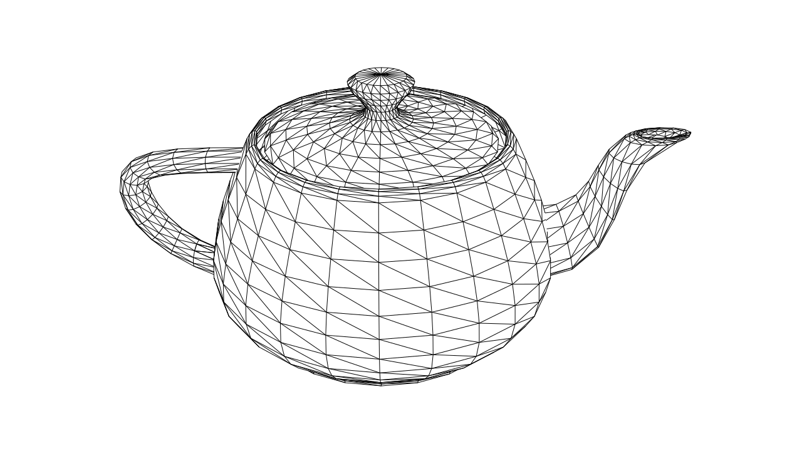

# mesh-svg-tool

Render a 3D mesh as a wireframe SVG, with optional hidden surface (edge) elimination.

Designed for pen plotting meshes with clean line output.

## Example Output


*Utah Teapot wireframe. [Inkscape](https://inkscape.org/)-modified output. See [examples/output.svg](examples/output.svg) for raw tool output.*


*Utah Teapot, pen on paper. Draw by [Creality Ender-3 V3 KE.](https://www.creality.com/products/creality-ender-3-v3-ke) Image edited in [Adobe Lightroom.](https://lightroom.adobe.com/)*

### Features

- Perspective projection
- Hidden surface (edge) elimination
- Optional back-face culling
- Configurable output units (mm, cm, in, px)
- Designed for pen plotters / CNC drawing workflows

## Getting Started

### Prequisites

- CMake https://cmake.org/
- vcpkg https://github.com/microsoft/vcpkg
    - https://learn.microsoft.com/en-us/vcpkg/get_started/get-started?pivots=shell-cmd
    - Clone and bootstrap `vcpkg` according to Microsoft's instructions.
  
## Building

### Linux / macOS

``` sh
git clone https://github.com/matthewgattis/mesh-svg-tool.git
cd mesh-svg-tool

mkdir -p build
cmake -S . -B build \
  -DCMAKE_BUILD_TYPE=Release \
  -DCMAKE_TOOLCHAIN_FILE="$VCPKG_ROOT/scripts/buildsystems/vcpkg.cmake" \
  -DVCPKG_TARGET_TRIPLET=x64-linux

cmake --build build -j
```

#### Binary (usually) ends up at:
```
./build/mesh-svg-tool
```

#### Notes
- Set `VCPKG_ROOT` to your vcpkg clone path, e.g.
```
export VCPKG_ROOT="$HOME/src/vcpkg"
```
- On macOS, you'll likely want:
```
-DVCPKG_TARGET_TRIPLET=x64-osx
```
- Or Apple Silicon:
```
-DVCPKG_TARGET_TRIPLET=arm64-osx
```
- Or Ninja:
``` bash
cmake -S .. -B build -G Ninja \
  -DCMAKE_BUILD_TYPE=Release \
  -DCMAKE_TOOLCHAIN_FILE="$VCPKG_ROOT/scripts/buildsystems/vcpkg.cmake" \
  -DVCPKG_TARGET_TRIPLET=x64-linux

cmake --build build
```

### Windows (MSVC + vcpkg)

Open PowerShell.

``` powershell
git clone https://github.com/matthewgattis/mesh-svg-tool.git
cd mesh-svg-tool
mkdir build
cd build
```

Configure with vcpkg toolchain:

``` powershell
cmake -S .. -B . `
  -DCMAKE_TOOLCHAIN_FILE=C:/path/to/vcpkg/scripts/buildsystems/vcpkg.cmake `
  -DVCPKG_TARGET_TRIPLET=x64-windows
```

Build:

```
cmake --build . --config Release
```

Binary will be located in:

```
build/Release/mesh-svg-tool.exe
```

## Render Example

Download a sample mesh:

``` bash
wget https://raw.githubusercontent.com/gnomeby/canvas3D/refs/heads/master/teapot.ply -O teapot.ply
```

Render to SVG:

``` bash
./mesh-svg-tool \
  --fovy 30 \
  --angle-axis -60 1 0 0 \
  --width 220 \
  --height 220 \
  --distance 15 \
  teapot.ply
```

On Windows:

``` powershell
.\mesh-svg-tool.exe --fovy 30 --angle-axis -60 1 0 0 --width 220 --height 220 --distance 15 teapot.ply
```

Output file defaults to:

```
output.svg
```

## Command Line Options

``` pgsql
Usage: mesh-svg-tool [options] mesh_filename
```

### Positional

| Argument        | Description                  |
| --------------- | ---------------------------- |
| `mesh_filename` | Mesh file to load (required) |

### Output

| Option           | Description            | Default      |
| ---------------- | ---------------------- | ------------ |
| `--svg`          | Output SVG filename    | `output.svg` |
| `--width`        | Output width           | `210`        |
| `--height`       | Output height          | `297`        |
| `--units`        | Units (mm, cm, in, px) | `mm`         |
| `--stroke-width` | Stroke width in units  | `0.5`        |

### Camera

| Option         | Description                                 | Default   |
| -------------- | ------------------------------------------- | --------- |
| `--fovy`       | Field of view (degrees)                     | `30`      |
| `--distance`   | Translate model along −Z                    | `10`      |
| `--angle-axis` | Rotation: angle (deg) + axis (x y z)        | `0 1 0 0` |

> `--angle-axis` note: Axis vector does not need to be provided normalized. It will be normalized internally before constructing the rotation.


### Rendering Controls

| Option                            | Description                              |
| --------------------------------- | ---------------------------------------- |
| `--no-hidden-surface-elimination` | Disable hidden surface elimination       |
| `--hse-step`                      | Step size for hidden surface elimination |
| `--do-back-face-culling`          | Enable back-face culling                 |
| `--debug`                         | Enable debug output                      |

## Pen Plotting Notes

- Use --units mm for physical plotting.
- Match output size to your printer bed.
- Adjust --stroke-width for pen thickness.
- Consider post-processing in Inkscape for layout tweaks.
